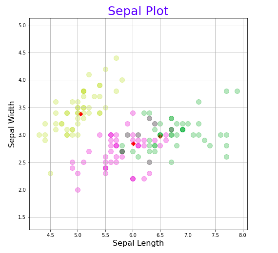
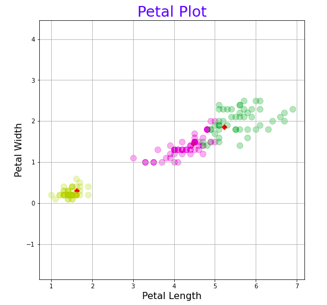

# Fuzzy C-means Algorithm

	
	

 
 

#### Type: Clustering algorithm 
#### Dataset used: Iris dataset

## Requirements:

- google colab or jupyter notebook

**packages**:
  
- Pandas - https://pandas.pydata.org/docs/getting_started/install.html  
- Numpy - https://numpy.org/install/  
- Matplotlib - https://matplotlib.org/stable/users/installing.html  
- sklearn - https://scikit-learn.org/stable/install.html  
	

## Steps involved:

1. Open the “fuzzy_c_means_algorithm_implementation.ipynb” file.You can either open it on google colab or through jupyter notebook. 
2. If you are using Jupyter notebook then install the required packages mentioned above.
3. After opening the file in google colab or jupyter notebook run all the cells and see the output.
4. Observe the plots to understand the results of the algorithm.

---

## References:

https://www.kaggle.com/prateekk94/fuzzy-c-means-clustering-on-iris-dataset  
https://youtu.be/FA-hJBu5Bkc  
http://www.cleartheconcepts.com/fuzzy-c-means/  
